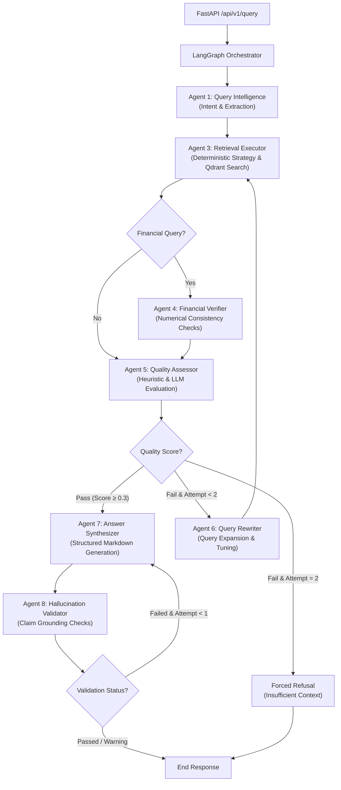

# M&A Due Diligence Intelligence Engine

[](https://www.python.org/)
[](https://qdrant.tech/)
[](https://github.com/langchain-ai/langgraph)
[]()
[](LICENSE)

A production-grade, hardware-aware **Hybrid Agentic RAG (Retrieval-Augmented Generation) Engine** designed to automate due diligence workflows in mergers and acquisitions (M&A). The system ingests multi-format data rooms (financials, legal contracts, board decks) and performs complex reasoning across hundreds of pages with **strict financial verification, hallucination guards, and traceable citations**.

---

## 🏗️ Multi-Agent Architecture

The engine is orchestrated using a **LangGraph StateGraph** featuring **7 specialized graph agents** that collaborate through a typed state and persist data via a **PostgresSaver checkpointer** (keyed by `deal_id` and `session_id`). Deterministic routing and configuration strategies are embedded directly within the retrieval executor to eliminate unnecessary graph hops and LLM overhead.



### The Specialized Agents & Functions:
1. **Query Intelligence (Agent 1)**: Classifies user intent, identifies required financial precision, and extracts metadata filters.
2. **Retrieval Strategy (Agent 2)**: A deterministic helper function within the executor that dynamically defines search weights and target categories based on intent signals, ensuring zero LLM overhead.
3. **Retrieval Executor (Agent 3)**: Queries Qdrant using hybrid search and merges results via Reciprocal Rank Fusion (RRF).
4. **Financial Verifier (Agent 4)**: Normalizes numbers (units, currencies) and cross-checks financial claims against raw tables.
5. **Quality Assessor (Agent 5)**: Scores context quality using a hybrid heuristic-LLM checker.
6. **Query Rewriter (Agent 6)**: Reforms queries to recover missing context during poor-retrieval loops.
7. **Answer Synthesizer (Agent 7)**: Compiles structured markdown reports grounded in retrieved facts.
8. **Hallucination Validator (Agent 8)**: Validates generated answers against source text to flag unsupported claims.

---

## ⚡ Engineering M&A Due Diligence Challenges 

M&A due diligence involves reasoning over massive, multi-format data rooms (e.g., 1000+ page PDFs, financial spreadsheets, legal contracts) where a wrong number is an absolute failure mode, not a graceful degradation. The engine solves these challenges through the following mechanisms:

### 1. Memory-Efficient PDF Streaming
Loading 1000+ page PDFs into memory causes Out-Of-Memory (OOM) failures. The ingestion pipeline uses **PyMuPDF (fitz)** to stream layout blocks and text page-by-page. It keeps the memory footprint flat regardless of document length.

### 2. Multi-Page Table Stitching
Financial statements and cap tables routinely span page breaks. Naive chunking slices these tables mid-row, destroying structure. The **MultiPageTableStitcher** extracts tables page-by-page using `pdfplumber`, fingerprints their column structures (column counts and header similarities), and automatically stitches continuation tables across page boundaries into a single markdown table section with matching page-range metadata.

### 3. Cell-Level Numeric Fidelity & 4-Representation Design
Financial queries require exact numbers. The engine processes tables into **4 concurrent representations** sharing a single `table_id`:
- **Narrative**: A text description of key items for semantic dense matching.
- **Row-by-Row**: Key-value pairs for precise cell lookup.
- **Metrics Summary**: Deterministic pandas-computed financial metrics (YoY growth, CAGR, margins) with explicit citation chains, preventing LLM arithmetic errors.
- **Markdown**: A clean markdown grid for answer generation.

If retrieval finds *any* of these representations, a table-id lookup automatically pulls all 4 sibling chunks from Qdrant. The synthesizer receives the exact markdown grid and verified computed metrics, preventing LLM hallucinations.

### 4. Hierarchical Parent-Child Context Expansion
Retrieving small, high-density chunks is optimal for search relevance, but lacks surrounding context. The engine retrieves 512-token semantic chunks but automatically swaps them for their larger **2048-token parent chunks** (from a dedicated parent collection) before synthesis. This provides the LLM with the full context (such as definitions or footnotes) without fragmenting the retrieval.

### 5. Layout-Aware Statistical Heading Detection
Instead of hardcoded formatting rules, headings are identified using per-page statistical font-size distribution (any text block with font size > page median * 1.2 is classified as a heading), maintaining hierarchical lineage across diverse document layouts.

---

## 🚀 Key Features & Advanced RAG Strategies

* **Three-Tier Chunking**: Documents undergo structural parsing, followed by semantic chunking (sentence-boundary aware with 10% overlap) and custom tables/metrics preservation to avoid fragmentation.
* **Hybrid Dense-Sparse Search**: Merges vector search (**BAAI/bge-m3**, 1024-dim) with sparse lexical search (**FastEmbed BM25**) in a unified Qdrant database.
* **Reciprocal Rank Fusion (RRF)**: Custom implementation de-duplicates overlap and merges dense and sparse scores into a unified relevance list.
* **Cross-Encoder Reranking**: Utilizes **BAAI/bge-reranker-v2-m3** for cross-attention query-passage scoring, applying a sigmoid-activation map to normalize scores.
* **Metadata & Version Control**: Automatically flags superseded document versions and traces information lineage.
* **PII & Risk Dashboards**: Screen for PII during ingestion and populate risk signals.
* **Token-Level Budget Tracking**: Features a Postgres-backed `BudgetTracker` enforcing per-model daily limits and RPM rate limits to keep API consumption under tight guardrails.

---

## 🛠️ Technology Stack

| Component | Technology | Detail |
|---|---|---|
| **Orchestration** | LangGraph | StateGraph with PostgresSaver |
| **Vector Database** | Qdrant | Hybrid search (Dense + Sparse), Self-Hosted |
| **LLMs (Hybrid)** | Gemini 3.1 & 3.5 | Primary agent & synthesis tasks via LiteLLM |
| **Local LLM** | Ollama / Qwen2.5 | Local fallback for verification & validation |
| **Embeddings** | BAAI/bge-m3 | 1024-dimensional dense vectors, FastEmbed BM25 |
| **Reranker** | BAAI/bge-reranker-v2-m3 | Cross-Encoder (Sigmoid Normalized) |
| **API Layer** | FastAPI | Structured JSON logging with Lifespan handlers |
| **Frontend UI** | Streamlit | Modular dashboard utilizing 8 custom components |

---

## 🧠 Key Challenges Overcome & Engineering Lessons

### 1. VRAM & Hardware Budgeting (12GB Constraints)
* **Problem**: Loading embedding models, cross-encoder rerankers, and a 14B local LLM concurrently would cause CUDA Out-of-Memory (OOM) failures.
* **Solution**: Implemented separate `ThreadPoolExecutor` pools for embedding and reranking to prevent concurrent execution starvation, running them asynchronously in non-blocking wrappers via PyTorch/CUDA.

### 2. JSON Mode Generation Truncation
* **Problem**: The local Ollama instance default context size (2048 tokens) was truncating JSON outputs under long evaluations, breaking state transitions.
* **Solution**: Patched the LiteLLM wrapper configurations to enforce a `num_ctx=8192` window for Ollama calls, preventing incomplete JSON structures.

### 3. Metadata Loss during Chunking
* **Problem**: Downstream verifiers skipped execution because chunking dropped structural markers (like `is_table` or `content_type`).
* **Solution**: Refactored the ingestion pipeline to propagate chunk-specific metadata attributes from processors to Qdrant payload nodes.

---

## ⚡ Quick Start

### 1. Prerequisites
Ensure you have Docker and Python 3.12+ installed.

### 2. Setup Env & Packages
```bash
# Clone the repository and configure environment variables
cp .env.example .env
# Edit .env and supply your GEMINI_API_KEY and database passwords

# Install PyTorch matching your CUDA hardware (example for CUDA 12.4)
pip install torch --index-url https://download.pytorch.org/whl/cu124

# Install requirements
pip install -r requirements.txt
```

### 3. Local Ollama Configuration (Headless)
Start the local Ollama server and pull the validation model:
```bash
# Start Ollama service (if not already running as a daemon)
ollama serve

# Fetch the local validation model
ollama pull qwen2.5:14b
```

### 4. Choose Deployment Path

#### Option A: Fully Containerized Stack (Recommended for Production/Evaluation)
Run the entire system (databases, API backend, and Streamlit frontend UI) inside Docker:
```bash
# Spin up all services
docker compose up -d

# Access the Streamlit dashboard: http://localhost:8501
# Access the FastAPI docs: http://localhost:8000/docs
```

#### Option B: Local Development Stack (Recommended for Development/Fast Reload)
Run only the databases in Docker and run the application services locally on your host:
```bash
# Spin up only PostgreSQL and Qdrant database services
docker compose up postgres qdrant -d

# Start the FastAPI backend server (in a new terminal window)
uvicorn api.main:app --reload

# Start the Streamlit frontend dashboard (in a separate terminal window)
streamlit run app/streamlit_app.py
```

### 5. Running Tests & E2E Validation
```bash
# Execute pytest suite (76 tests covering async safety, agents, and RRF)
pytest

# Execute live E2E pipeline validation against 19 golden Q&A pairs
python tests/run_end_to_end_validation.py
```

---

## 📊 Verification & Validation Results

The pipeline has been thoroughly verified using a **synthetic deal room** comprising financial statements, merger agreements, and board slide decks. The end-to-end RAG evaluations are tracked in **[RESULTS.md](RESULTS.md)**.

* **Test Pass Rate**: 100% (76/76 unit & integration tests passing).
* **E2E Validation Rate**: 100% (19/19 queries successfully completed).
* **Average E2E Latency**: ~69.6s (complete multi-agent verification and validation loops).
* **Avg Grounding Fact Recall**: 48.3% (up to 68% on complex financial queries).
* **Citation Match Quality**: 47.4% exact grounding citation trace across multi-version files.

---

## 📄 License

This project is licensed under the [MIT License](LICENSE).
