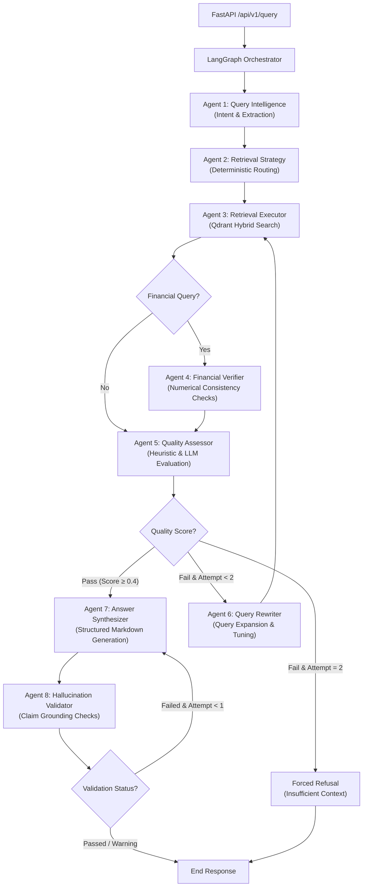

# M&A Due Diligence Intelligence Engine

[](https://www.python.org/)
[](https://qdrant.tech/)
[](https://github.com/langchain-ai/langgraph)
[]()
[]()

A production-grade, hardware-aware **Hybrid Agentic RAG (Retrieval-Augmented Generation) Engine** designed to automate due diligence workflows in mergers and acquisitions (M&A). The system ingests multi-format data rooms (financials, legal contracts, board decks) and performs complex reasoning across hundreds of pages with **strict financial verification, hallucination guards, and traceable citations**.

---

## 🏗️ Multi-Agent Architecture

The engine is orchestrated using a **LangGraph StateGraph** featuring **8 specialized agents** that collaborate through a typed state and persist data via a **PostgresSaver checkpointer** (keyed by `deal_id` and `session_id`).



### The 8 Specialized Agents:
1. **Query Intelligence (Agent 1)**: Classifies user intent, identifies required financial precision, and extracts metadata filters.
2. **Retrieval Strategy (Agent 2)**: Dynamically defines search weights and target categories.
3. **Retrieval Executor (Agent 3)**: Queries Qdrant using hybrid search and merges results via Reciprocal Rank Fusion (RRF).
4. **Financial Verifier (Agent 4)**: Normalizes numbers (units, currencies) and cross-checks financial claims against raw tables.
5. **Quality Assessor (Agent 5)**: Scores context quality using a hybrid heuristic-LLM checker.
6. **Query Rewriter (Agent 6)**: Reforms queries to recover missing context during poor-retrieval loops.
7. **Answer Synthesizer (Agent 7)**: Compiles structured markdown reports grounded in retrieved facts.
8. **Hallucination Validator (Agent 8)**: Validates generated answers against source text to flag unsupported claims.

---

## 🚀 Key Features & Advanced RAG Strategies

* **Three-Tier Chunking**: Documents undergo structural parsing, followed by semantic chunking (leveraging layout hierarchy) and custom tables/metrics preservation to avoid fragmentation.
* **Hybrid Dense-Sparse Search**: Merges vector search (**BAAI/bge-m3**, 1024-dim) with sparse lexical search (**FastEmbed BM25**) in a unified Qdrant database.
* **Reciprocal Rank Fusion (RRF)**: Custom implementation de-duplicates overlap and merges dense and sparse scores into a unified relevance list.
* **Cross-Encoder Reranking**: Utilizes **BAAI/bge-reranker-v2-m3** for cross-attention query-passage scoring, applying a sigmoid-activation map to normalize scores.
* **Metadata & Version Control**: Automatically flags superseded document versions and traces information lineage.
* **PII & Risk dashboards**: Automatically screens for PII during ingestion and populates an interactive risk signal dashboard for legal items (e.g. change of control, material adverse change).
* **Token-Level Budget Tracking**: Features a Postgres-backed `BudgetTracker` enforcing per-model daily limits and RPM rate limits to keep API consumption under tight guardrails.

---

## 🛠️ Technology Stack

| Component | Technology | Detail |
|---|---|---|
| **Orchestration** | LangGraph | StateGraph with PostgresSaver |
| **Vector Database** | Qdrant | Hybrid search (Dense + Sparse), Self-Hosted |
| **LLMs (Hybrid)** | Gemini 3.1 & 3.5 | Primary agent & synthesis tasks via LiteLLM |
| **Local LLM** | Ollama / Qwen2.5 | Local fallback for verification & validation |
| **Embeddings** | BAAI/bge-m3 | 1024-dimensional dense vectors, FastEmbed BM25 |
| **Reranker** | BAAI/bge-reranker-v2-m3 | Cross-Encoder (Sigmoid Normalized) |
| **API Layer** | FastAPI | Structured JSON logging with Lifespan handlers |
| **Frontend UI** | Streamlit | Modular dashboard utilizing 8 custom components |

---

## 🧠 Key Challenges Overcome & Engineering Lessons

### 1. VRAM & Hardware Budgeting (12GB Constraints)
* **Problem**: Loading embedding models, cross-encoder rerankers, and a 14B local LLM concurrently would cause CUDA Out-of-Memory (OOM) failures.
* **Solution**: Implemented a dynamic caching strategy. PyTorch runs on separate CUDA streams, and Ollama is configured with a 60-minute keep-alive. If memory limits are hit, the system automatically runs a zero-keep-alive unload policy or drops to Qwen2.5-7B-instruct-Q4_K_M.

### 2. JSON Mode Generation Truncation
* **Problem**: The local Ollama instance default context size (2048 tokens) was truncating JSON outputs under long evaluations, breaking state transitions.
* **Solution**: Patched the LiteLLM wrapper configurations to enforce a `num_ctx=8192` window for Ollama calls, preventing incomplete JSON structures.

### 3. Metadata Loss during Chunking
* **Problem**: Downstream verifiers skipped execution because chunking dropped structural markers (like `is_table` or `content_type`).
* **Solution**: Refactored the ingestion pipeline to propagate chunk-specific metadata attributes from processors to Qdrant payload nodes.

---

## ⚡ Quick Start

### 1. Prerequisites
Ensure you have Docker and Python 3.12+ installed. 

### 2. Local Setup
```bash
# Clone the repository and configure environment variables
cp .env.example .env
# Edit .env and supply your GEMINI_API_KEY and database passwords

# Install PyTorch matching your CUDA hardware (example for CUDA 12.4)
pip install torch --index-url https://download.pytorch.org/whl/cu124

# Install requirements
pip install -r requirements.txt
```

### 3. Infrastructure & Databases
Start Qdrant and Postgres databases:
```bash
docker compose up -d
```
Start Ollama and fetch the local validation model:
```bash
ollama run qwen2.5:14b
```

### 4. Running the Application
```bash
# Run the FastAPI backend server
uvicorn api.main:app --reload

# Launch the Streamlit frontend dashboard (separate terminal)
streamlit run app/streamlit_app.py
```

### 5. Running Tests & E2E Validation
```bash
# Execute pytest suite (76 tests covering async safety, agents, and RRF)
pytest

# Execute live E2E pipeline validation against 19 golden Q&A pairs
python tests/run_end_to_end_validation.py
```

---

## 📊 Verification & Validation Results

The pipeline has been thoroughly verified using a **synthetic deal room** comprising financial statements, merger agreements, and board slide decks. The end-to-end RAG evaluations are tracked in **[RESULTS.md](file:///d:/GEN%20AI/M&A/RESULTS.md)**.

* **Test Pass Rate**: 100% (76/76 unit & integration tests passing).
* **E2E Validation Rate**: 100% (19/19 queries successfully completed).
* **Average E2E Latency**: ~69.6s (complete multi-agent verification and validation loops).
* **Avg Grounding Fact Recall**: 48.3% (up to 68% on complex financial queries).
* **Citation Match Quality**: 47.4% exact grounding citation trace across multi-version files.

---

## 📄 License

Proprietary — all rights reserved.
