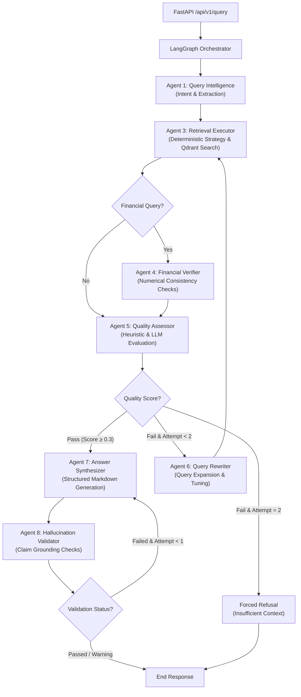

# M&A Due Diligence Intelligence Engine

[](https://www.python.org/)
[](https://qdrant.tech/)
[](https://github.com/langchain-ai/langgraph)
[]()
[](LICENSE)

A production-grade, hardware-aware **Hybrid Agentic RAG (Retrieval-Augmented Generation) Engine** that automates due diligence workflows in mergers & acquisitions (M&A). It ingests multi-format data rooms (financial statements, legal contracts, board decks) and performs multi-step reasoning over them with **deterministic financial verification, hallucination guarding, and traceable citations** — prioritizing "I don't know" over confident hallucination on high-stakes financial/legal questions.

> Built as a portfolio project to demonstrate production-style agentic system design: multi-agent orchestration, hybrid retrieval, deterministic numerical guardrails, and graceful degradation under real-world constraints (rate limits, GPU memory, local fallback models).

---

## Table of Contents
- [Architecture](#-multi-agent-architecture)
- [Core Engineering Challenges Solved](#-engineering-ma-due-diligence-challenges)
- [Key Features](#-key-features--advanced-rag-strategies)
- [Tech Stack](#-technology-stack)
- [Skills Demonstrated](#-skills-demonstrated)
- [Quick Start](#-quick-start)
- [Results & Honest Limitations](#-results--validation)
- [Roadmap](#-roadmap)
- [Project Structure](#-project-structure)

---

## 🏗️ Multi-Agent Architecture

Orchestrated with a **LangGraph StateGraph** of **7 specialized graph nodes** (plus one deterministic, zero-LLM helper) collaborating through typed shared state, with checkpointing keyed by `(deal_id, session_id)`. Retrieval strategy selection is deterministic, not LLM-driven, to cut unnecessary latency and cost.



### The Agents

| # | Agent | Role |
|---|---|---|
| 1 | **Query Intelligence** | Classifies user intent, flags numerical-precision needs, extracts metadata filters |
| 2 | **Retrieval Strategy** *(deterministic, no LLM)* | Picks dense/sparse weights and top-k by query type — zero added latency |
| 3 | **Retrieval Executor** | Queries Qdrant using hybrid search and merges results via Reciprocal Rank Fusion (RRF).|
| 4 | **Financial Verifier** | Normalizes numbers(units/currency) and cross-checks figures against source tables |
| 5 | **Quality Assessor** | Scores context quality using a hybrid heuristic-LLM checker. |
| 6 | **Query Rewriter** | Reformulates the query when retrieval quality is insufficient (max 2 loops) |
| 7 | **Answer Synthesizer** | Generates structured, cited markdown answers |
| 8 | **Hallucination Validator** | Validates every claim against retrieved source text before to flag unsupported claims |

---

## ⚡ Engineering M&A Due Diligence Challenges

M&A due diligence involves reasoning over massive, multi-format data rooms (e.g., 1000+ page PDFs, financial spreadsheets, legal contracts) **a wrong number is a hard failure, not graceful degradation**.  The engine solves these challenges through the following mechanisms:

**1. Memory-Efficient PDF Streaming** — Loading 1000+ page PDFs into memory causes Out-Of-Memory (OOM) failures. The ingestion pipeline uses **PyMuPDF (fitz)** to stream layout blocks and text page-by-page. It keeps the memory footprint flat regardless of document length.

**2. Multi-Page Table Stitching** — Financial statements and cap tables routinely span page breaks. Naive chunking slices these tables mid-row, destroying structure. The **MultiPageTableStitcher** extracts tables page-by-page using `pdfplumber`, fingerprints their column structures (column counts and header similarities), and automatically stitches continuation tables across page boundaries into a single markdown table section with matching page-range metadata.

**3. Cell-Level Numeric Fidelity (4-Representation Tables)** — Financial queries require exact numbers. The engine processes tables into **4 concurrent representations** sharing a single `table_id`:
- **Narrative**: A text description of key items for semantic dense matching.
- **Row-by-Row**: Key-value pairs for precise cell lookup.
- **Metrics Summary**: Deterministic pandas-computed financial metrics (YoY growth, CAGR, margins) with explicit citation chains, preventing LLM arithmetic errors.
- **Markdown**: A clean markdown grid for answer generation.

If retrieval finds *any* of these representations, a table-id lookup automatically pulls all 4 sibling chunks from Qdrant. The synthesizer receives the exact markdown grid and verified computed metrics, preventing LLM hallucinations.

**4. Hierarchical Parent-Child Context Expansion** — Retrieving small, high-density chunks is optimal for search relevance, but lacks surrounding context. The engine retrieves 512-token semantic chunks but automatically swaps them for their larger **2048-token parent chunks** (from a dedicated parent collection) before synthesis. This provides the LLM with the full context (such as definitions or footnotes) without fragmenting the retrieval.

**5. Layout-Aware Heading Detection** — Instead of hardcoded formatting rules, headings are identified using per-page statistical font-size distribution (any text block with font size > page median * 1.2 is classified as a heading), maintaining hierarchical lineage across diverse document layouts.

---

## 🚀 Key Features & Advanced RAG Strategies

- **Three-Tier Chunking** — Documents undergo structural parsing, followed by semantic chunking (sentence-boundary aware with 10% overlap) and custom tables/metrics preservation to avoid fragmentation.
- **Hybrid Dense + Sparse Search** — Merges vector search (**BAAI/bge-m3**, 1024-dim) with sparse lexical search (**FastEmbed BM25**) in a unified Qdrant database.
- **Reciprocal Rank Fusion** — Custom implementation de-duplicates overlap and merges dense and sparse scores into a unified relevance list.
- **Cross-Encoder Reranking** — Utilizes `BAAI/bge-reranker-v2-m3` for cross-attention query-passage scoring, applying a sigmoid-activation map to normalize scores with sigmoid-normalized scores within `[0,1]`
- **Document Versioning** — Automatically flags superseded document versions and traces information lineage.
- **PII & Risk Detection** — flags PII at ingestion (excluded from retrieval by default) and surfaces risk signals (change-of-control, MAC clauses, litigation, etc.) on a dashboard
- **Token-Budget Governance** — Features a Postgres-backed (`BudgetTracker`) daily quota + RPM rate limiting per model, with a graceful in-memory fallback if Postgres is unavailable to keep API consumption under tight guardrails.

---

## 🛠️ Technology Stack

| Component | Technology | Detail |
|---|---|---|
| **Orchestration** | LangGraph | StateGraph + PostgresSaver (falls back to in-memory checkpointing) |
| **Vector Database** | Qdrant | Hybrid (dense + sparse) search, Self-Hosted, with local-disk fallback |
| **LLMs (Cloud)** | Gemini (via LiteLLM) | Agent reasoning & answer synthesis |
| **LLM (Local)** | Ollama / Qwen2.5-14B | Zero-cost fallback for verification & validation |
| **Embeddings** | BAAI/bge-m3 | 1024-dimensional  dense vectors + FastEmbed BM25 sparse |
| **Reranker** | BAAI/bge-reranker-v2-m3 | Cross-encoder (Sigmoid Normalized) |
| **API Layer** | FastAPI | Structured JSON logging, async lifespan management |
| **Frontend** | Streamlit | 8 custom dashboard components (citations, risk, version history, agent trace) |
| **Database** | PostgreSQL | Budget tracking, LangGraph checkpoints |

---

## 🎯 Skills Demonstrated

This project was built to exercise (and showcase) the following:

- **Agentic system design** — multi-step LLM orchestration with explicit self-correction loops, conditional routing, and bounded retry budgets (not naive single-shot RAG)
- **Production reliability patterns** — graceful degradation under failure (Qdrant local fallback, Postgres → in-memory budget fallback, LangGraph MemorySaver fallback), atomic budget consumption to avoid TOCTOU races, async-safe rate limiting
- **Retrieval engineering** — hybrid dense/sparse search, RRF fusion, cross-encoder reranking, parent-child context expansion, table-aware chunking
- **Deterministic correctness guardrails** — financial arithmetic computed in pandas (never delegated to an LLM), explicit citation chains for every derived metric
- **Hardware-aware engineering** — VRAM budgeting across embedding/reranker/local-LLM models on a 12GB GPU constraint, separate thread pools to prevent resource starvation
- **Full-stack delivery** — FastAPI backend, Streamlit UI, Dockerized multi-service deployment, 76 automated tests covering async safety, RRF correctness, and agent logic

---

## ⚡ Quick Start

### 1. Prerequisites
Ensure you have Docker and Python 3.12+ installed.

### 2. Setup Env & Packages
```bash
# Clone the repository and configure environment variables
cp .env.example .env
# Edit .env — add your GEMINI_API_KEY and database password

# Install PyTorch matching your CUDA version (example: CUDA 12.4)
pip install torch --index-url https://download.pytorch.org/whl/cu124
# Install requirements
pip install -r requirements.txt
```

### 3. Local Ollama (fallback model)
Start the local Ollama server and pull the validation model:
```bash
# Start Ollama service (if not already running as a daemon)
ollama serve

# Fetch the local validation model
ollama pull qwen2.5:14b
```

### 4. Choose Deployment Path

#### Option A: Fully Containerized Stack (Recommended for Production/Evaluation)
Run the entire system (databases, API backend, and Streamlit frontend UI) inside Docker:
```bash
# Spin up all services
docker compose up -d

# Access the Streamlit dashboard: http://localhost:8501
# Access the FastAPI docs: http://localhost:8000/docs
```

#### Option B: Local Development Stack (Recommended for Development/Fast Reload)
Run only the databases in Docker and run the application services locally on your host:
```bash
# Spin up only PostgreSQL and Qdrant database services
docker compose up postgres qdrant -d

# Start the FastAPI backend server (in a new terminal window)
uvicorn api.main:app --reload

# Start the Streamlit frontend dashboard (in a separate terminal window)
streamlit run app/streamlit_app.py
```

### 5. Running Tests & E2E Validation
```bash
# Execute pytest suite (76 tests covering async safety, agents, and RRF)
pytest

# Execute live E2E pipeline validation against 19 golden Q&A pairs
python tests/run_end_to_end_validation.py
# live E2E run against 19 golden Q&A pairs
```

---

## 📊 Results & Validation

Validated against a synthetic data room (financial statements, merger agreement, board deck) with 19 hand-built golden Q&A pairs spanning financial, legal, comparative, summary, and multi-hop queries.

**Pipeline reliability:** 100% (19/19 queries completed without an unhandled exception — no crashes, timeouts, or malformed responses).

**Answer quality on this small synthetic corpus:**

| Metric | Result |
|---|---|
| Queries that retrieved enough context to answer | 10/19 (53%) |
| Queries correctly refused for insufficient context | 9/19 (47%) |
| Fact recall on answered queries | 48.3% avg (up to 68% on financial queries) |
| Citation-source match on answered queries | 47.4% |
| Avg latency per query | ~70s |

**Why this is reported honestly rather than rounded up:** the refusal path is a *deliberate safety feature* — the Quality Assessor and Hallucination Validator are designed to decline rather than guess when retrieval is weak. On a 3-document, ~4,700-token synthetic corpus, sparse retrieval signal is genuinely thin for several query types (e.g., comparative questions spanning bidder tables), so the system correctly chose to refuse rather than fabricate. That's the intended behavior under the "wrong number is a hard failure" design goal stated above — it's also exactly the failure mode this project exists to engineer against.

The ~70s average latency is mostly a function of free-tier Gemini RPM limits (5–15 RPM) plus the local Qwen2.5-14B verification/validation calls — not an architectural ceiling. See [Roadmap](#-roadmap).

Full per-query breakdown: [`RESULTS.md`](RESULTS.md).

---

## 🧭 Roadmap

- [ ] Decompose comparative queries into sub-queries (one bidder/methodology per Qdrant lookup) instead of relying solely on query expansion
- [ ] Cache embeddings for repeated query expansions to cut redundant model calls
- [ ] Swap to a paid LLM tier or batch async calls to reduce the ~70s latency floor
- [ ] Replace the in-memory deal store with a Postgres-backed table for multi-instance deployments
- [ ] Expand the synthetic corpus to better stress-test comparative and multi-hop retrieval

---

## 🧠 Key Engineering Lessons

**VRAM budgeting (12GB constraint):** running an embedding model, a cross-encoder reranker, and a 14B local LLM concurrently risks CUDA OOM. Solved with separate `ThreadPoolExecutor` pools for embedding vs. reranking so one doesn't starve the other.

**Local LLM JSON truncation:** Ollama's default 2048-token context window was silently truncating JSON outputs during long evaluations. Fixed by forcing `num_ctx=8192` for all Ollama calls.

**Metadata loss during chunking:** the Financial Verifier was silently skipping execution because chunking dropped structural markers (`is_table`, `content_type`). Fixed by propagating chunk metadata explicitly through to Qdrant payloads.

**TOCTOU race in budget tracking:** an earlier `check → increment` pattern allowed two concurrent requests to both pass the budget check and overshoot the daily limit. Replaced with a single atomic conditional `UPDATE` statement.

More decisions and trade-offs are logged in [`DECISIONS_LOG.md`](DECISIONS_LOG.md).

---

## 📁 Project Structure

```
api/                  FastAPI routes, request/response models
app/                  Streamlit UI (8 components) + dashboard
src/
  agents/             8 LangGraph agent nodes + retrieval strategy
  data_processing/     PDF/DOCX/PPTX/Excel processors, chunkers, PII/risk detectors
  llm/                 LiteLLM wrapper, budget tracker, rate limiter, prompt templates
  vector_db/           Qdrant client, hybrid search, RRF fusion, reranker
  workflow/            LangGraph state machine, orchestrator, conditional edges
  utils/               Logging, token counting, audit log, metrics
tests/                 76 tests + offline pipeline validation + live E2E runner
config/                Qdrant, LiteLLM, and chunking YAML configs
```

---

## 📄 License

Licensed under the [MIT License](LICENSE).

---

## 👤 Author

**[Makilesh M]** — [LinkedIn](https://www.linkedin.com/in/makilesh/) · [GitHub](https://github.com/makilesh) · [Portfolio](https://makilesh.github.io/)

*Built as a self-directed project to explore production patterns in agentic RAG systems for high-stakes, accuracy-critical domains.*